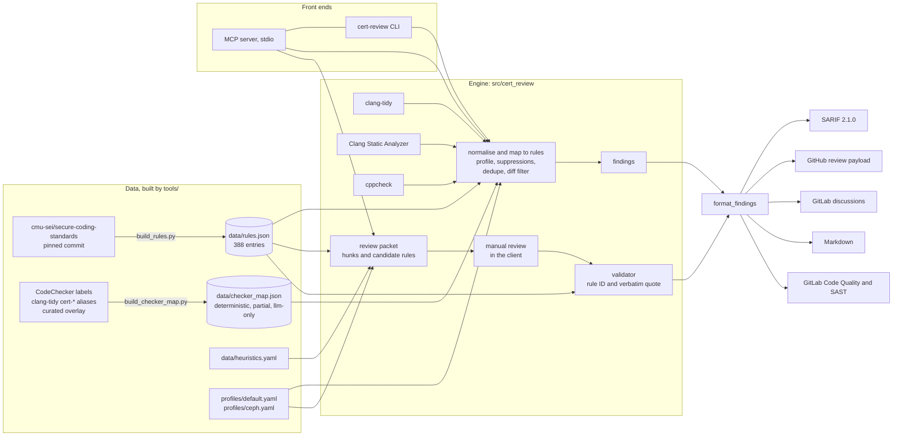

# Architecture

Source of the diagram. Regenerate the PNG with
`mmdc -i arch.mmd -o docs/images/architecture.png -b white -s 2` after editing it.

```mermaid
flowchart LR
  subgraph data["Data, built by tools/"]
    A["cmu-sei/secure-coding-standards<br/>pinned commit"] -->|"build_rules.py"| R[("data/rules.json<br/>388 entries")]
    B["CodeChecker labels<br/>clang-tidy cert-* aliases<br/>curated overlay"] -->|"build_checker_map.py"| M[("data/checker_map.json<br/>deterministic, partial, llm-only")]
    H["data/heuristics.yaml"]
    P["profiles/default.yaml<br/>profiles/ceph.yaml"]
  end
  subgraph engine["Engine: src/cert_review"]
    T1["clang-tidy"] --> N
    T2["Clang Static Analyzer"] --> N
    T3["cppcheck"] --> N
    N["normalise and map to rules<br/>profile, suppressions,<br/>dedupe, diff filter"] --> F["findings"]
    R --> N
    M --> N
    P --> N
    R --> K["review packet<br/>hunks and candidate rules"]
    H --> K
    P --> K
    K --> L["manual review<br/>in the client"]
    L --> V["validator<br/>rule ID and verbatim quote"]
    R --> V
  end
  F --> O["format_findings"]
  V --> O
  O --> S1["SARIF 2.1.0"]
  O --> S2["GitHub review payload"]
  O --> S3["GitLab discussions"]
  O --> S4["Markdown"]
  O --> S5["GitLab Code Quality and SAST"]
  subgraph front["Front ends"]
    MCP["MCP server, stdio"] --- CLI["cert-review CLI"]
  end
  MCP --> N
  CLI --> N
  MCP --> K
```
